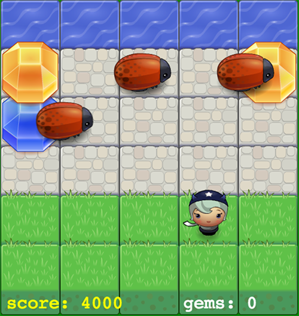

# [Classic Arcade Game Clone](https://github.com/udacity/frontend-nanodegree-arcade-game)

## Screenshot

## How to run the game

To play the game just follow the following link [https://hryakandrey.github.io/arcade-game/](https://hryakandrey.github.io/arcade-game/).

## Usage

Use cursor keys to navigate the player.

The aim of the game is to reach 10000 points. Every 2000 points next level is achieved, leading to a new speed of enemies and look of the player. Every gem adds 500 points to the score. When the player reaches the water 1000 points are added. If player collides an enemy, the score and gems counters reset.

[© Andrey Lysov](https://hryakandrey.github.io/)
